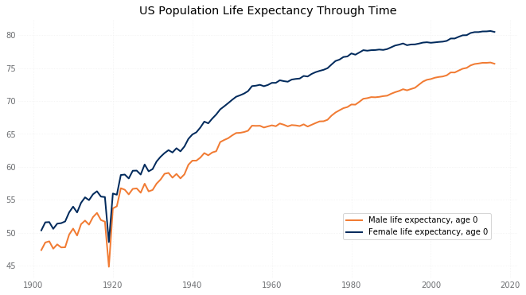
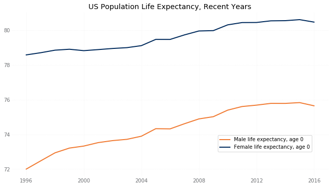
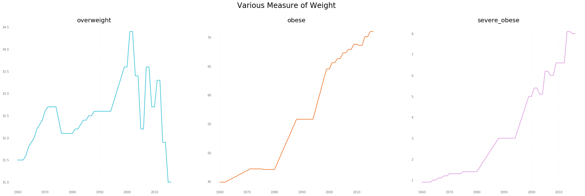
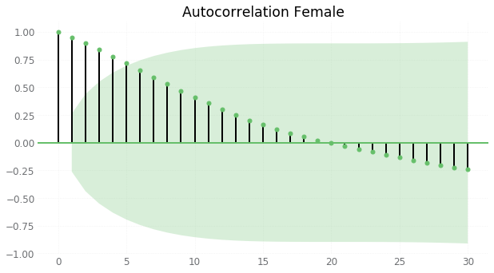
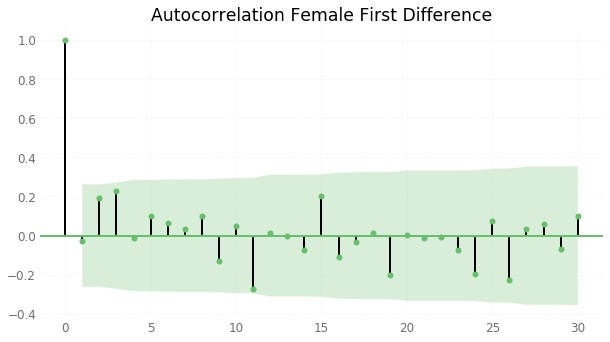
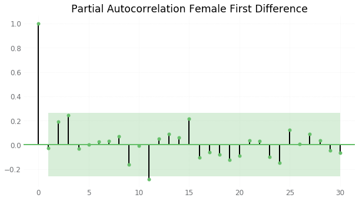

# US Population Mortality Analysis

Capstone Project for General Assembly Data Science Immersive Program

October 22, 2018

---

### Executive Summary & Results

My question is whether or not we can find external, macro-level, variables that help explain the change in mortality from year to year.   In particular, mortality in the United States has, overtime, decreased, leading to longer lives on average.  There have been periods of time, particularly related to disease and war, where improving mortality has stalled or even reversed.  These times of worsening mortality have been brief and the improving trend of mortality rates quickly has quickly recovered from these negative events.  

The computation of entire mortality tables for a given year is laborious and time consuming.  If there are other factors that can help predict changes in life expectancy, particularly factors that are readily measured for other purposes, these factors could give a first look into what to expect once the definitive statistic, derived from the actual mortality tables, is available.

Overall, I created two similar time series models one to test male mortality and one to test female mortality.  I gathered many potential features, but during the modeling process narrowed down the variables that were effective to:  income inequality, the labor participation rate, the return on the S&P 500, percentage of the population that was overweight, year-over-year percent increase in military spending, and the alcohol consumption per capita.  All of these variables were used to build the male model.  

Three features were not only unnecessary for the female model, but they made the model perform significantly worse:  income inequality, labor participation rate, and the military spending measure.

My conclusion is that, there are indeed, factors that are beneficial in forecasting the direction of population mortality.

---

### Presentation

Please see [presentation](presentation/US_mortality_presentation.pdf) for the slides presented on the last day of class.  This presentation goes over the exploratory data analysis which highlights key metrics, shows how mortality rates and life expectancy has changed over time, and gives some additional detail with respect to the time series model used for the analysis.

---

### Data Gathering Process
The data gathering process was cumbersome.  The features that impact mortality were selected based on general assumptions on what could impact life expectancy, factors that could potentially be influencing the opioid epidemic, and factors that may model the overall state of the world for the US population.  The target variables, male and female life expectancy, are not directly observable, but rather, are statistics computed on raw mortality data.  The mortality data is available, on a multi-year lag, from the Social Security Administration.  The Jupyter notebooks in the `code` section of the GitHub repository perform the calculations to turn the mortality data into target variables.

The modeling sources of each of the data elements are documented in the Jupyter notebooks in the `data` folder.  Many data elements were reported at various points in time in varying formats.  I typically converted those data elements into csv files outside of Python and then read in the files.  For example, the percentage of the population covered by health insurance was an element that has not been consistently measured over time.  I found a government report from 1970 that referenced rates in 1953, 1958, 1963, and 1970.  The more recent surveys from the Census Bureau's Annual Social & Economic Supplement provide data for the last decade.  A third source helped fill in the gaps in between.

The World Bank, Census Bureau, National Institutes of Health, the Centers for Disease Control and Prevention, the FRED database of the St. Louis Federal Reserve Bank, and the Health and Human Services Department all provided data that were used in the model.  

---

### Exploratory Data Analysis - Target Variables
A demonstration of the inherent phenomena that I am trying to model is conveniently  displayed by the graph below.  This graph shows the male mortality rates of persons aged between 25 and 95 from 1900 until 2015.  The graph illustrates the overall decrease that has been observed.

	

One can observe a few spikes in mortality: 1918 (Spanish Influenza and WW I), in the 1940s (WW II) for lower ages, and a bit of increase in the 1990s (likely AIDS deaths).

Removing the 1918 portion of the graph and comparing males and females at ages 20 and 40, we can see these mortality changes are prominent for male mortality but not for female mortality.

From the data, it is easy to take a single age, look at the ratio over time, and determine if mortality is improving or getting worse for that specific slice of the population.  For instance if we look at the same four charts but look at the rate of change, we can see a less predictable pattern.

It is clear from the above analysis, that we should continue to segregate male and female mortality for purposes of this analysis.  There are clearly different drivers impacting how mortality changes over time for males versus females.

It is also clear that we either analyze a single age, or groups of ages, or come up with a different metric for the target variable. One measure that can be used is life expectancy, .

	

where  is the probability that someone aged x will live for t years.  To encorporate the entire table, I selected the life expectancy at age 0 as my target variable, .  

The graph below shows the change in  over time for men and women.

	

And this graph shows the last few years in more detail.  One can see that the life expectancy is beginning to decrease in 2014/2015.  

	

---

### Exploratory Data Analysis - Feature Variables

The feature variables were derived from a variety of sources, mainly from US government agencies.  The sources of those data variables are documented in the Jupyter notebook [Features](code/01-data-acquisition-for-features.ipynb).  The data files that the notebook reads are saved in the folder `data`.

There were a couple of variables, when plotted, that had a strange pattern.  These are discussed in the EDA notebook for features [Feature EDA](code/02-exploratory-data-analysis.ipynb).  One item that was very interesting was the weight measure.  I collected three measures from the CDC.  Each of these are a percentage of the population that is:  Overweight, Obese, and Severely Obese.  What I did not initially understand is that that `overweight` measure is overweight but not obese.  The `obese` measure is both obese and severely obese.

	

These charts show that the as the population was moving from overweight to obese, the population that was neither overweight nor obese did not move into the overweight category at the same rates.

---

### Modeling & Model Assessment
Even though it was initially quite clear that this was a problem that would require time series analysis, I still put my data through the paces of the regression techniques that I know:  linear regression with and without regularization, decision trees/forests/boosted.  I didn't have enough observations to try neural network techniques.  As expected, these models produced horrible results.

I started the time series work by evaluating the `stationarity` of my target variable.  Since I was looking at male and female mortality separately, that meant repeating the process for both male life expectancy and female life expectancy.  Luckily, the Dicky Fuller test showed the same result for both.  The initial variables did not exhibit stationarity, but the first difference did.  

Armed with a first difference for the ARIMA model, I then used the auto-correlation and partial auto correlation plots to determine the `p` and `q` parameter for the test.  I show the female version of the ACF and PACF plots below, starting with the female life expectancy and then the first difference plots.

	

	

	

After consulting with Matt Brems and reviewing the documentation [here](https://people.duke.edu/~rnau/411arim3.htm), I chose an ARIMA(0,1,0) and included an additional variable equal to an 11 year lag of the endogenous variable.  

I used a train/test split based on time.  The observations from 1960 to 1995 were used as training observations and the test observations were from 1996 to 2015.  I tested various combinations of exogenous variables and also a few different `p` and `q` hyper-parameters.  The final models have different exogenous variables for male versus female but both models were ARIMA(0,1,0).

|R squared | Male model| Female model|
|:---|:---:|:---:|
|train|99.1%|99.1%|
|test|97.8%|96.6%|

Feature list with indications of features used in each model:

|Feature collected | Male model| Female model|
|:---|:---:|:---:|
|First difference|[✓]|[✓] |
|GDP|[ ]|[ ]|
|GDP per capita|[ ]|[ ]|
|GDP increase yr over yr|[ ]|[ ]|
|Household income 40th percentile|[ ]|[ ]|
|Household income 95th percentile|[ ]|[ ]|
|Income inequality measure|[✓]|[ ]|
|Labor participation rate|[✓]|[ ]|
|Military spending - dollars|[ ]|[ ]|
|Military spending as a percent of GDP|[ ]|[ ]|
|Military spending per capita|[ ]|[ ]|
|Military spending yr over yr increase |[✓]|[ ]|
|Inflation|[ ]|[ ]|
|Performance of S&P 500|[✓]|[✓]|
|Return on 3mo T-bill|[ ]|[ ]|
|Return on 10y T-bond|[ ]|[ ]|
|Health insurance coverage percent|[ ]|[ ]|
|Overweight|[✓]|[✓]|
|Obese|[ ]|[ ]|
|Severely obese|[ ]|[ ]|
|Alcohol consumption per capita|[✓]|[✓]|
|Tobacco usage percent|[ ]|[ ]|

The model only performs slightly better than a fully auto-regressive model (0.5% in terms of R-squared).  However, I do believe that the interactions of life expectancy and exogenous variables is instructive and worthwhile to monitor. 

---

### Conclusion
My conclusion is that, there are indeed, factors that are beneficial in forecasting the direction of population mortality.  The factors that influence the model are different between male and female mortality, and these factors make some intuitive sense based on historical gender roles.  For example, military factors influence only male mortality and had a detrimental impact to the model results for female mortality.  I will be curious if, over time, those differences persist as society continues to progress beyond those past gender norms.

---

### Directory of Files in GitHub Repository:

* The `data` folder contains csv input files and csv output from data cleaning.
* The `assets` folder contains saved graphs, mainly for inclusion in this report.
* The `code` folder contains four main Jupyter notebooks used in the analysis:
	> * [Data Collection on Features](code/01-data-acquisition-for-features.ipynb) imports the data for the exogenous variables.  
	> * [EDA on Features](code/02-exploratory-data-analysis.ipynb) walks through some basic visualization on the features/exogenous variables.    
	> * [Targets](code/03-data-collection-targets-with-EDA.ipynb) pulls together the data needed to target or `y` variable for the project.  The notebook also walks through the exploratory data analysis for this information.  
	> * [Time Series Model](code/04-Time-Series-Modeling.ipynb) walks through the time series modeling of the data.

