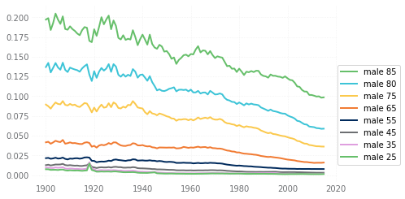
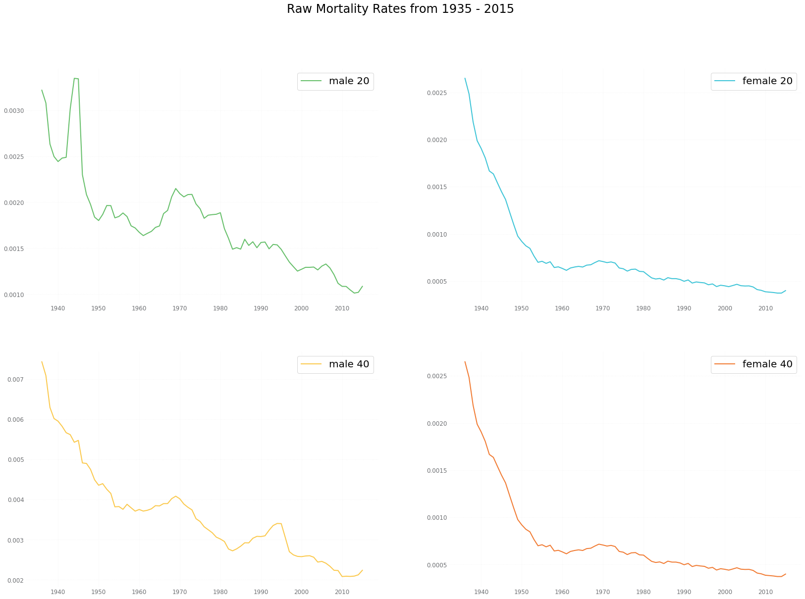
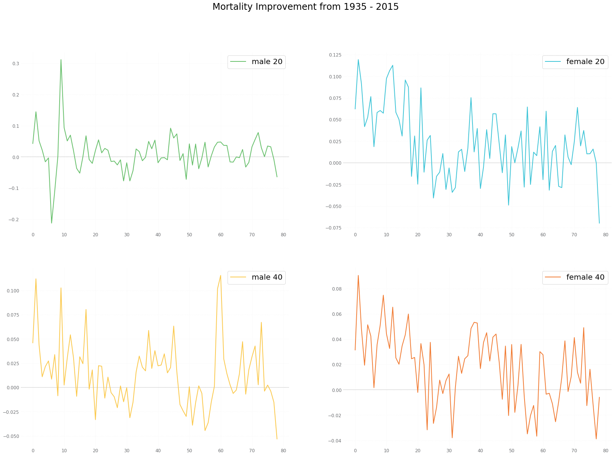

# US-Population-Mortality-Analysis

Capstone Project for General Assembly Data Science Immersive Program

October 22, 2018

---

## Executive Summary & Results

My question is whether or not we can find external, macro-level, variables that help explain the change in mortality from year to year.  In paritcular, mortality in the United States has, overtime, decreased leading to longer lives on average.  There have been periods of time, particularly related to disease and war, where improving mortality has stalled or even reveresed.  These times of worsening mortality have been brief and the downward tragectory of mortality rates has continued.  

The computation of entire mortality tables for a given year is laborious and time consuming.  If there are other factors that can help predict changes in life expectancy, particularly factors that are readily measured for other purposes, these factors could give a first look into what to expect once the definitive statistic, derived from the actual mortality tables, is available.

Overall, I created two similar time series models one to test male mortality and one to test female mortality.  I gathered many potential features, but during the modeling process narrowed down the variables that were effective to:  income inequality, the labor participation rate, teh return on the S&P 500, percentage of the population that was overweight, annual percent increase in military spending, and the alcohol consumption per capital.  All of these variables were used to build the male model.  

Three features were not only unneccesary for the female model, but they made the model perform significantly worse:  income inequality, labor participation rate, and the military spending measure.

My conclusion is that, there are indeed, factors that are beneficial in forecasting the direction of population mortality.

---

## Presentation

Please see class_presentation.pptx for the slides presented on the last day of class.  This presentation goes over the exploratory data analysis which highlights key metrics, shows how mortality rates and life epectancy has changed over time, and gives some additional detail with respect to the time series model used for the analysis.

---

## Data Gathering Process
The data gathering process was cumbersome.  The features that impact mortality were selected based on general assumptions on what could impact life expectancy, on factors that could potentially be influencing the opioid epidemic, and on factors that may model the overall state of the world for the US population.  The target variables, male and female life expectancy, are not directly observable, but rather, are statistics computed on raw mortality data.  The mortality data is available, on a mult-year lag, from the Social Security Administration.  The Jupyter notebooks perform the calcualtions to turn the moratlity data into target variables.

As discussed below, the sources of each of the data elements are documented in the Jupyter notebooks.  Many data elements were reported at various points in time in varying formats.  I typically converted those data elements into csv files outside of Python and then read in the files.  For example, the percentage of the population covered by health insurance was an element that has not been consistently measured over time.  I found a government report from 1970 that referenced rates in 1953, 1958, 1963, and 1970.  The more recent surveys from the Census Bureau's Annual Social & Economic Supplement provide data for the last decade.  A third source helped fill in the gaps in between.

The World Bank, Census Bureau, National Institutes of Health, the Centers for Disease Control and Prevention, the FRED database of the St. Louis Federal Reserve Bank, and the Health and Human Services Department all provided data that were used in the model.  

---

## Exploratory Data Analysis - Target Variables
A demonstration of the inherent phenomina that I am trying to model is conventiently displayed by the graph below.  This graph shows the male mortality rates of persons aged between 25 and 95 from 1900 until 2015.  The graph illustrates the overall decrease that has been observed.

One can observe a few spikes in mortality in 1918 (Spanish Influenza and WW I), in the 1940s (WW II) for lower ages, and a bit of increase in the 1990s (likely AIDS deaths).

Removing the 1918 portion of the graph and comparing males and females at ages 20 and 40, we can see these mortality changes are prominent for the male mortality but not for female mortality.

From the data, it is easy to take a single age, look at the ratio over time, and determine if mortality is improving or getting worse for that specific slice of the population.  For instance if we look at the same four charts but look at the rate of change, we can see a less predictable pattern.

It is clear from the above analysis, that we should continue to segregate male and female mortality for purposes of this analysis.  There are clearly different drivers impacting how mortality changes over time for males versus females.

It is also clear that we either analyze a single age, or groups of ages, or come up with a different metric for the target variable. One measure that can be used is life expectancy.

where  is the probability that someone aged x will live for t years.

---

## Modeling & Model Assessment

---

## Conclusion
My conclusion is that, there are indeed, factors that are beneficial in forecasting the direction of population mortality.  The factors that influence the model are different between male and female mortality, and these factors make some intuitive sense based on past gender roles.  I will be curious if, over time, those differences persist as society continues to progress beyond historical gender norms.

---

## Directory of Key Notebooks:

03-Time-Series-Modeling.ipynb

This notebook reads in the files created in the steps above that contain potential features and the target variables.  The time-series modeling is then explored using statsmodel packages.  An ARIMA(0,1,0) model is created in the notebook.

